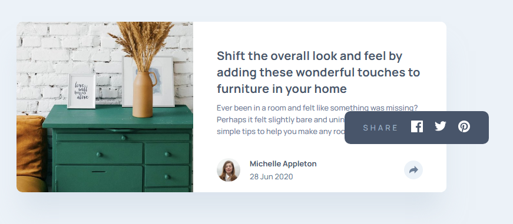
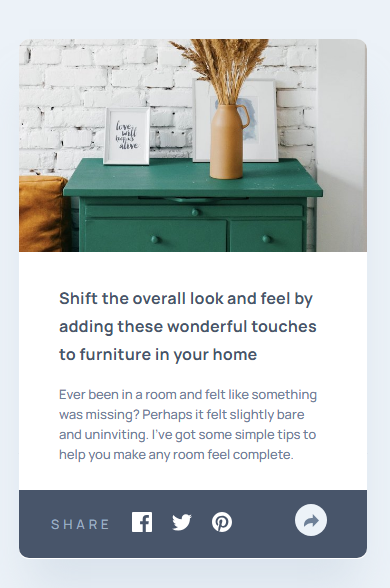

# Frontend Mentor - Article preview component solution

This is a solution to the [Article preview component challenge on Frontend Mentor](https://www.frontendmentor.io/challenges/article-preview-component-dYBN_pYFT). Frontend Mentor challenges help you improve your coding skills by building realistic projects. 

## Table of contents

- [Overview](#overview)
- [Screenshot](#screenshot)
- [Links](#links)
- [Built with](#built-with)
- [Author](#author)

## Overview

### Screenshot

### Links

- Solution URL: https://rajancp.github.io/FEM-Article-preview-component/
### Built with

- Semantic HTML5 markup
- CSS custom properties
- Javascript

## Author

- Frontend Mentor - [@RajanCP](https://www.frontendmentor.io/profile/RajanCP)
- GitHub - [@RajanCP] (https://github.com/RajanCP)